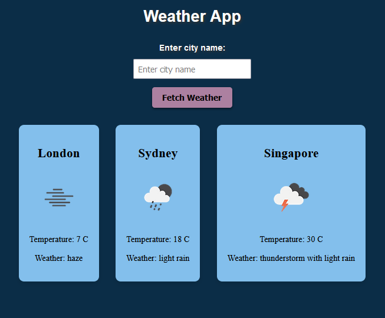

# Weather App

This weather app is designed to give users an up-to-date and accurate weather report for any city in the world.
The button can be used to add information for up to 3 cities in total. Once the limit of 3 cities is reached, the button will no longer be active.
The app utilises an [API](https://api.openweathermap.org) to gather current weather data, including icon, temperature and description.
In order to use the app, please define your own API_KEY in a config.js file, following the format shown in the config_example.js file.

