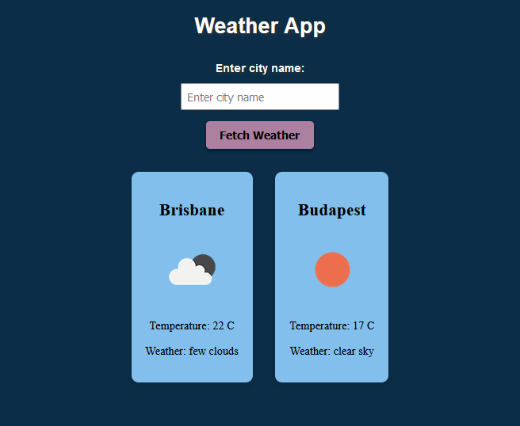

# Weather App

This weather app is designed to give users an up-to-date and accurate weather report for any city in the world.
It utilises an API (https://api.openweathermap.org) to gather current weather data, including icon, temperature and description.
To use the app please use your own API_KEY in the weather_app.js file.

